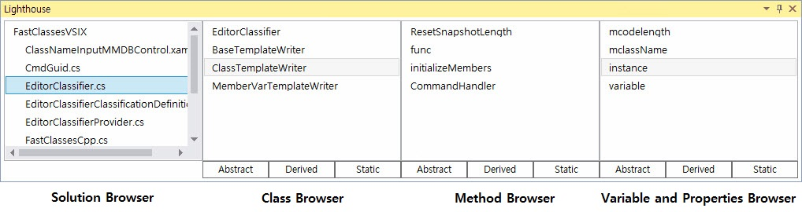
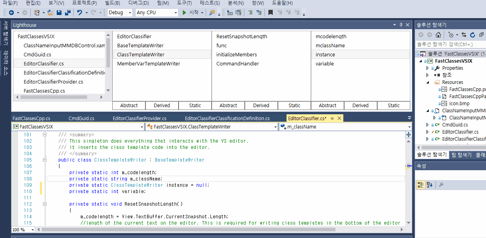
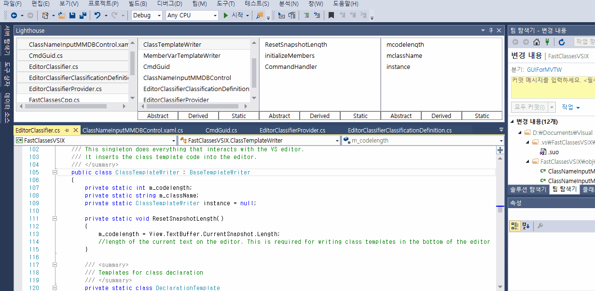
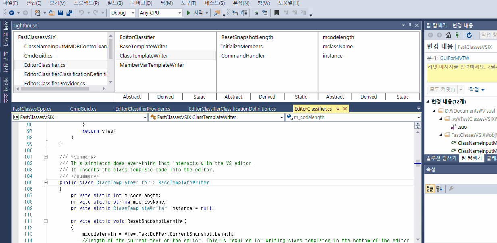

# Lighthouse Class Browser

A [Pharo](http://pharo.org/) style class browser cross-platform IDE plugin.


## Introduction
Lighthouse is a Pharo smalltalk's Nautilus System Browser style class browser plugin.
The plugin module is a C++ implemented shared library file.
Using [Swig](https://github.com/swig/swig), [Protobuf](https://github.com/google/protobuf) you can use the module to implement your own.
Because of the dependencies, the module is only portable to platforms supported by both swig and protobuf.

Refer the [docs](docs/) for further detail on how you can implement Lighthouse Class Browser.


## Implementation Example 

A Visual Studio, C# implementationo is provided.
below are the features of the Visual Studio implementation.



Lighthouse always shows you the the classes of the selected project items.
It also shows you member methods, variables and properties of the selected class.

### Code Navigation



By selecting any of the Class, Method, Properties displayed, you can directly move to its position.

### Hide Abstract Elements



By pressing `Abstract` button, encapsulated classes, methods, variables and properties are hidden from the browser.
Using this button you can directly check the encapsualation structure of your code.

### Show Only Static Elements



The `Static` button only shows the static elements.
So you can identify static elements at a glance.


## Current Version Info
* version 2.2.5
* Asynchronus source element data collection is implemented.

## Upcoming Features
* C#, Visual Studio implementation
* Java, IntelliJ implementation

## Dependencies
* [Swig](https://github.com/swig/swig), GPLv3
* [Protobuf](https://github.com/google/protobuf), custom license
* [gtest](https://github.com/google/googletest/tree/master/googletest), custom license


## License
```
    	                  LighthouseClassBrowser
                Copyright (C) 2017  Red-Portal, jzi040941

    This program is free software: you can redistribute it and/or modify
    it under the terms of the GNU General Public License as published by
    the Free Software Foundation, either version 3 of the License, or
    (at your option) any later version.

    This program is distributed in the hope that it will be useful,
    but WITHOUT ANY WARRANTY; without even the implied warranty of
    MERCHANTABILITY or FITNESS FOR A PARTICULAR PURPOSE.  See the
    GNU General Public License for more details.

    You should have received a copy of the GNU General Public License
    along with this program.  If not, see <http://www.gnu.org/licenses/>.
```