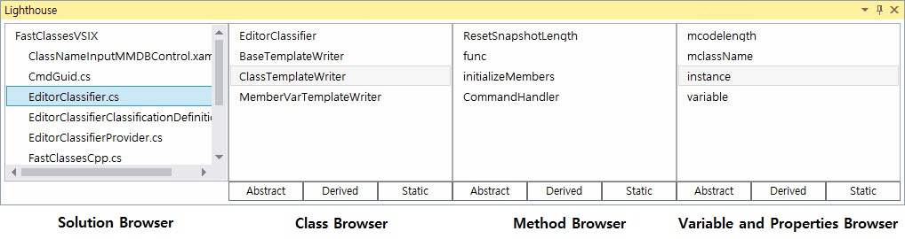

# Implementing Lighthouse
## Lighthouse User Inteface



A Typical implementation of lighthouse should look like this.
4 Listboxes and each listboxes contain buttons.

Instructions on the buttons will he discussed further down.

### Solution Browser
The content of the ```Solution Browser``` is language dependent.
But it must contain the elements just on top of ```classes``` on the hierarchy.

In case of C# it's source files.
In case of Java it's packages.

Selecting any of the elements in the ```Solution Browser``` will make
the class browser show the classes contained within the selected ```solution browser``` elements.

The ```Solution Browser``` Listbox must support multiple selections.

### Class Browser
The ```Class Browser``` contains the classes contained within the selected elements of the ```Solution Browser```.

Selecting any of the class elements of the ```Class Browser``` will display the contained
methods and member variables/instances inside the class
on the ```Method Browser``` and ```Variabels and Properties Browser```.  

### Method Browser
Displays the member methods of the currently selected class.

### Variables and Properties Browser
Displayes the member variables instances etc.. the properties of the currently selecte class.


## Lighthouse Main Module Interface
```C++
class LighthouseInterface
{
public:
	void updateElement_mtx(std::string const& );

	bool firstBrowserDataPush(std::string const& ); //push the new app state, pull the changed data state
	std::string firstBrowserDataPull();

	bool secondBrowserDataPush(std::string const& );
	std::string secondBrowserDataPull_first();
	std::string secondBrowserDataPull_second();
};
```

This is the interface of the Lighthouse Main Module(shared library).
It basically has 3 functionalities.

1. Update the source elements asynchronously.
2. Process events in the ```Solution Browser``` (First Browser).
3. Process events in the ```Class Browser``` (Second Browser).

### Serialization and deserialization in protobuf
In order to handle data directly in the C++ module, lighthouse uses protobuf
for serialization and deserialization.  

As you can see, all arguments of LightouseInterface are strings.
It's because protobuf allows handling of C++ STL strings.

In order for correct interaction, please refer to the swig reference
to find which of your target languages types is correctly translated to C++ strings by swig.

Basically, every interactions with Lighthouse modules are done the way described below.

```
Pushing: Native Data -> Protobuf Encoded Native data -> Swig translated std::string
Pulling: std::string -> swig translated Native data -> Protobuf Decoded Native data
```
Thanks to protobuf, this process is not so expensive.


### Updating Source Elements
Because Lighthouse is a plugin that should be used in development,
It must update it's data content on real time.
This only can be done by scanning the whole project source every time
A change is suspected. Doing this without disturbing the development
can only be done if done as asynchronously.

Lighthouse can receive data, stores it, and automatically updates the data
it is handling using the stored, fresh data.

And this can be done thread safe. Storing and retreiving data within lighthouse is thread safe.
(unfortunately not lock-free).

You can just push the updated data asynchronously in real time to ```updateElement_mtx```,
and lighthouse will automatically retrieve this pushed data when it needs it.

### Handling Browser Events
Any time a browser element is raised,
just pushed the data into lighthouse and lighthouse will store the results.
You can can retreive the result when you need using the ```Pull``` methods.

For example,
A new element is selected in the class browser.  

1. Push the selected element into ```secondBrowserDataPush```.
2. Pull the resulting data using ```secondBrowserDataPull_first```.
And update the ```Method Browser```.
3. Pull the resulting data using ```secondBrowserDataPull_second```.
And update the ```Properties Browser```.

Below is pseudocode 

```csharp
private LighthouseInterface _interface;

private void event_SecondBrowserEvent(EventArgs e)
{
   var selected = e.getSelectedItem();
   var serialData = _serializer.serialize(selected);

   bool flag = _interface.secondBrowserDataPush(serialData);

   if(!flag)
      throw;

   var resultMethods = secondBrowserDataPull_first();
   var resultProperties = secondBrowserDataPull_second();

   _thirdBrowser.update(resultMethods);
   _fourthBrowser.update(resultProperties);
}
```

### Buttons
Buttons are completely implementation defined. They have no dependency on the Lighthouse main module.
However we suggest following the guidlines. The guidelines suggest implementing buttons such as,
Abstract, Static.

As an example, implementing Abstract is as below,

```
When receiving data from lighthouse,
filter the ones who are not an abstracted data type.
```
below is pseudocode

```Csharp
void update(CodeElement)//CodeElement types are the protobuf mesage types
{
    // Other operations....
    List<CodeElement> result;

    var abstracted = result.filter(
        λelement.(if(element.isAbstract)
                  then true;
                  else false)
                  );
    
    ListBox.update(abstracted);

}
```
